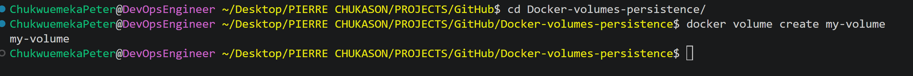
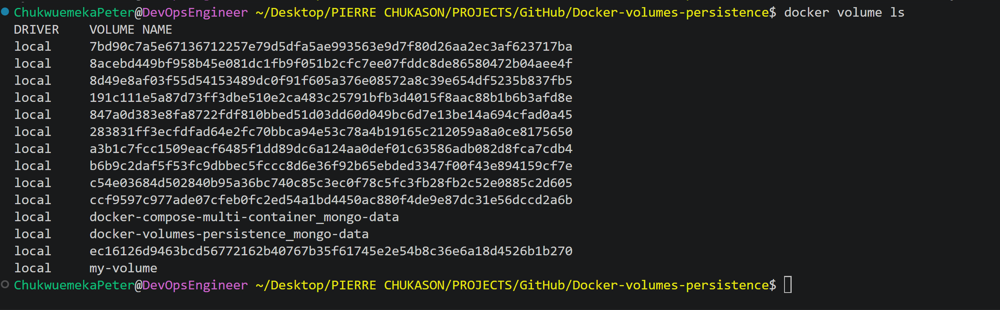
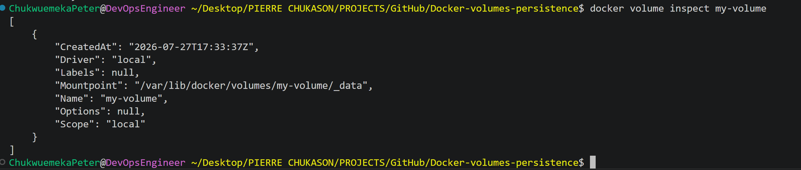
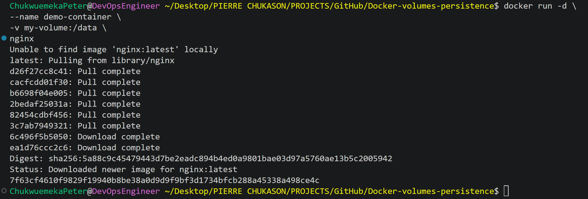
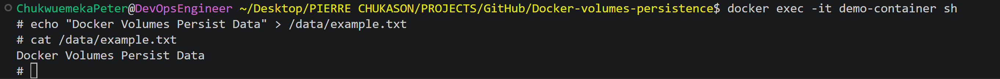
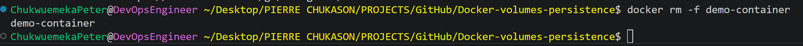
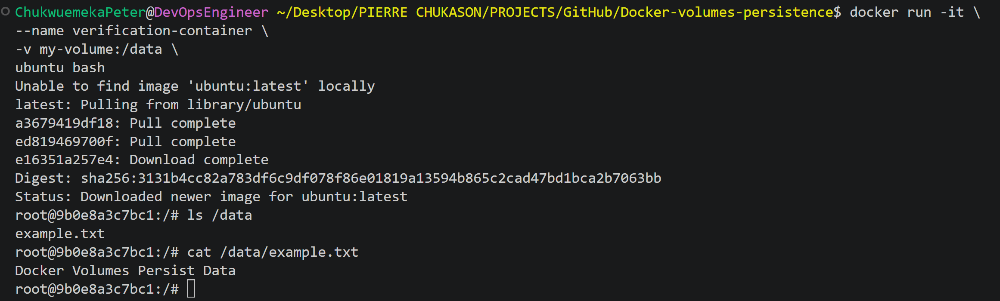
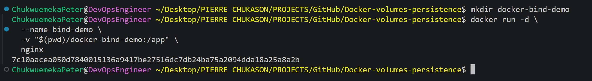

# Docker Volumes for Persistent Data Storage

<p align="center">


</p>

---

# Project Overview

Docker containers are designed to be lightweight, portable, and ephemeral. While this makes them ideal for modern application deployment, it also means that any data stored only inside a container is lost when that container is removed.

This project demonstrates how Docker Volumes solve that problem by providing persistent storage that exists independently of a container's lifecycle.

Using Docker running on my local development machine, I created and managed Docker volumes, attached them to containers, verified data persistence after container recreation, explored bind mounts, inspected Docker-managed storage, and documented the complete implementation process.

By the end of this project, I gained a practical understanding of Docker's storage architecture and how persistent storage supports reliable, stateful containerized applications.

---

# Project Objectives

This project was completed to achieve the following objectives:

- Understand Docker's storage architecture.
- Learn why containers require persistent storage.
- Create Docker volumes.
- Attach volumes to running containers.
- Verify that data persists after container removal.
- Inspect Docker-managed storage.
- Compare Docker volumes with bind mounts.
- Practice Docker volume management commands.
- Document the implementation from start to finish.

---

# Why Persistent Storage Matters

Containers are intentionally designed to be disposable.

Whenever a container is deleted, everything stored inside its writable layer disappears unless that data has been stored externally.

Without persistent storage:

- Uploaded files are lost.
- Application logs disappear.
- Database records are removed.
- Runtime configuration changes are discarded.

Docker Volumes separate application data from the container itself, allowing data to remain available even when containers are replaced or recreated.

---

# What Are Docker Volumes?

A Docker Volume is a Docker-managed storage location that exists independently of any individual container.

Instead of storing important files inside the container, applications store them inside a mounted volume. Because the volume has its own lifecycle, it continues to exist even after the original container has been removed.

Key characteristics include:

- Managed entirely by Docker
- Independent of the container lifecycle
- Optimized for performance
- Reusable across multiple containers
- Easier to back up and restore than container storage

---

# Docker Volumes vs Bind Mounts

Docker supports two primary methods for persistent storage.

| Feature | Docker Volume | Bind Mount |
|----------|---------------|------------|
| Managed by Docker | ✅ | ❌ |
| Uses Existing Host Directory | ❌ | ✅ |
| Portable | ✅ | Limited |
| Performance | Optimized | Depends on Host |
| Backup | Easier | Manual |
| Production Ready | ✅ | Depends on Use Case |
| Development Friendly | ✅ | ✅ |

Docker Volumes are generally preferred for production workloads, while bind mounts are commonly used during local development because they provide direct access to files on the host machine.

---

# Project Architecture

```text
                 Developer
                      │
                      ▼
          Local Development Machine
                      │
                      ▼
               Docker Engine
                      │
                      ▼
          Running Docker Container
                      │
             Mounted Docker Volume
                      │
                      ▼
           Persistent Application Data
                      │
      Container Removed and Recreated
                      │
                      ▼
             Data Still Available
```

The Docker Volume exists independently of the container, allowing application data to survive container recreation.

---

# Technologies Used

| Technology | Purpose |
|------------|---------|
| Docker Engine | Container Runtime |
| Docker Desktop | Local Container Platform |
| Docker Volumes | Persistent Storage |
| Bind Mounts | Host File Integration |
| Linux Containers | Application Runtime |
| Git | Version Control |
| GitHub | Repository Hosting |

---

# Key Skills Demonstrated

This project demonstrates practical experience with:

- Docker CLI
- Docker Volumes
- Persistent Storage
- Bind Mounts
- Container Lifecycle Management
- Docker Storage Architecture
- Linux File System Concepts
- Volume Inspection
- Volume Lifecycle Management
- Technical Documentation

---

# High-Level Workflow

This project follows a simple workflow to demonstrate persistent storage.

```text
Create Docker Volume
        │
        ▼
Run a Container
        │
        ▼
Mount the Volume
        │
        ▼
Create Data
        │
        ▼
Remove the Container
        │
        ▼
Create a New Container
        │
        ▼
Mount the Same Volume
        │
        ▼
Verify the Data Still Exists
```

This workflow demonstrates that the lifecycle of application data is independent of the lifecycle of the container.

---

# Repository Structure

```text
docker-volumes-persistence/
│
├── README.md
├── LICENSE
├── .gitignore
│
├── docs/
|   ├── commands.md
│   ├── setup.md
│   ├── troubleshooting.md
│   |── lessons-learned.md
|   |── video-script.md
│
├── images/
│   ├── architecture.png
│   ├── volume-create.png
│   ├── volume-list.png
│   ├── volume-inspect.png
│   ├── container-with-volume.png
│   ├── data-created.png
│   ├── container-removed.png
│   ├── data-persisted.png
│   ├── bind-mount.png
│   └── cleanup.png
│
```

---

# Learning Outcomes

After completing this project, I gained hands-on experience in:

- Creating and managing Docker volumes
- Mounting persistent storage into containers
- Understanding Docker's storage architecture
- Preserving application data across container recreation
- Inspecting Docker-managed storage
- Working with bind mounts
- Managing the Docker volume lifecycle
- Troubleshooting storage-related issues
- Documenting technical implementations

---

# Prerequisites

To reproduce this project, ensure the following tools are installed on your local machine.

| Requirement | Description |
|-------------|-------------|
| Docker Desktop (or Docker Engine) | Container Runtime |
| Git | Version Control |
| Terminal | Command Execution |
| Text Editor or IDE | Documentation and File Editing |
| Web Browser | Viewing Documentation and GitHub |

---

# Environment Details

The project was completed using the following environment.

| Component | Value |
|-----------|-------|
| Host Environment | Local Development Machine |
| Container Platform | Docker Desktop (or Docker Engine) |
| Operating System | Windows Operating System |
| Storage | Docker Volumes |
| Alternative Storage | Bind Mounts |
| Version Control | Git |
| Repository Hosting | GitHub |

---

# Understanding Docker Storage

Every Docker container includes a writable filesystem that is created when the container starts.

Any files written to this writable layer exist only for the lifetime of that container.

When a container is removed:

- Files stored inside the writable layer are deleted.
- Installed software inside the writable layer is removed.
- Temporary application data is lost.

This behavior is intentional because containers are designed to be disposable and easily replaceable.

Docker Volumes solve this limitation by storing important data outside the container's writable filesystem.

---

# Docker Storage Architecture

```text
                    Docker Engine
                          │
            ┌─────────────┴─────────────┐
            │                           │
            ▼                           ▼
    Running Container          Docker Volume
            │                           │
            └────────── Mount ──────────┘
                        │
                        ▼
            Persistent Application Data
```

The application accesses its data through the mounted volume, while Docker manages the storage location on the host machine.

---

# Container Lifecycle vs Volume Lifecycle

One of Docker's most important concepts is that containers and volumes have separate lifecycles.

```text
Create Container
        │
        ▼
Write Data
        │
        ▼
Remove Container
        │
        ▼
Volume Still Exists
        │
        ▼
Create New Container
        │
        ▼
Reuse Existing Volume
        │
        ▼
Original Data Available
```

This separation allows stateful applications, such as databases, file storage services, and logging systems, to preserve important data even when containers are replaced.

---

---

# Implementation

This section walks through the practical steps used to demonstrate Docker's persistent storage capabilities using Docker volumes.

---

# Step 1: Create a Docker Volume

The first step is to create a named Docker volume.

```bash
docker volume create my-volume
```

Docker creates a managed storage location that exists independently of any container.

You can verify that the volume was created successfully by listing all available Docker volumes.

---

## Image: Creating the Volume

```text
images/volume-create.png
```

<p align="center">



</p>

---

# Step 2: List Available Volumes

Display all Docker-managed volumes.

```bash
docker volume ls
```

Example output:

```text
DRIVER    VOLUME NAME
local     my-volume
```

Listing volumes confirms that Docker successfully created the persistent storage location.

---

## Image: Listing Volumes

```text
images/volume-list.png
```

<p align="center">



</p>

---

# Step 3: Inspect the Volume

Docker allows you to inspect detailed information about a volume.

```bash
docker volume inspect my-volume
```

The inspection output includes information such as:

- Volume name
- Driver
- Mount point
- Scope
- Labels

This command is useful when troubleshooting storage issues or locating where Docker stores persistent data on the host system.

---

## Image: Volume Inspection

```text
images/volume-inspect.png
```

<p align="center">



</p>

---

# Step 4: Run a Container with the Mounted Volume

Create a container and attach the Docker volume.

```bash
docker run -d \
--name demo-container \
-v my-volume:/data \
nginx
```

Explanation:

- `-d` runs the container in detached mode.
- `--name` assigns a readable container name.
- `-v my-volume:/data` mounts the Docker volume inside the container.
- `nginx` is the image used for this demonstration.

Any files written to `/data` are stored inside the Docker volume rather than inside the container's writable layer.

---

## Image: Container with Mounted Volume

```text
images/container-with-volume.png
```

<p align="center">



</p>

---

# Step 5: Create Persistent Data

Open a shell inside the running container.

```bash
docker exec -it demo-container sh
```

Create a file inside the mounted directory.

```bash
echo "Docker Volumes Persist Data" > /data/example.txt
```

Confirm that the file exists.

```bash
cat /data/example.txt
```

Because the file is stored inside the mounted volume, it is no longer tied to the lifecycle of the container.

---

## Image: Creating Data

```text
images/data-created.png
```

<p align="center">



</p>

---

# Step 6: Remove the Container

Delete the running container.

```bash
docker rm -f demo-container
```

Although the container is removed, the Docker volume remains untouched.

This demonstrates that volumes and containers have separate lifecycles.

---

## Image: Container Removed

```text
images/container-removed.png
```

<p align="center">



</p>

---

# Step 7: Verify Data Persistence

Create a new container and attach the same Docker volume.

```bash
docker run -it \
--name verification-container \
-v my-volume:/data \
ubuntu bash
```

Display the contents of the mounted directory.

```bash
ls /data
```

Read the file created by the previous container.

```bash
cat /data/example.txt
```

If the file is displayed successfully, Docker has preserved the data even though the original container no longer exists.

This confirms that the data is stored in the Docker volume rather than inside the container itself.

---

## Image: Persistent Data Verified

```text
images/data-persisted.png
```

<p align="center">



</p>

---

# Step 8: Working with Bind Mounts

Docker also supports bind mounts, which map an existing directory from the host machine directly into a container.

Example:

```bash
docker run -d \
--name bind-demo \
-v /path/to/local/folder:/app \
nginx
```

Unlike Docker volumes, Docker does not manage the source directory of a bind mount. The directory already exists on the host machine, and changes made on either side are immediately visible to the other.

Bind mounts are commonly used for:

- Local software development
- Editing application source code
- Sharing configuration files
- Collecting application logs

---

## Image: Bind Mount

```text
images/bind-mount.png
```

<p align="center">



</p>

---

# Implementation Summary

By completing these steps, the following objectives were successfully achieved:

- Created a Docker volume.
- Attached the volume to a running container.
- Stored application data in the mounted volume.
- Removed the original container.
- Started a new container using the same volume.
- Verified that the original data remained available.
- Explored bind mounts as an alternative storage option.

This implementation demonstrates one of Docker's most important storage principles: **containers are ephemeral, but data does not have to be**.

---

# Docker Volume Management

Once a volume has been created, Docker provides several commands for managing its lifecycle.

## Create a Volume

```bash
docker volume create project-data
```

Creates a new Docker-managed volume.

---

## List Volumes

```bash
docker volume ls
```

Lists all available Docker volumes.

---

## Inspect a Volume

```bash
docker volume inspect project-data
```

Displays detailed information including:

- Volume name
- Driver
- Mount point
- Labels
- Scope

---

## Remove a Volume

```bash
docker volume rm project-data
```

A volume can only be removed when it is no longer attached to any container.

---

## Remove Unused Volumes

```bash
docker volume prune
```

Removes all unused Docker volumes and helps reclaim disk space.

> **Note:** Use this command carefully. Any unused volumes and their data will be permanently deleted.

---

# Common Docker Volume Commands

| Command | Description |
|----------|-------------|
| `docker volume create <name>` | Create a new volume |
| `docker volume ls` | List all volumes |
| `docker volume inspect <name>` | View detailed information about a volume |
| `docker volume rm <name>` | Remove a specific volume |
| `docker volume prune` | Remove all unused volumes |

---

# Monitoring Docker Storage

Docker provides tools for monitoring disk usage across images, containers, volumes, and build cache.

```bash
docker system df
```

This command displays storage usage for:

- Images
- Containers
- Local volumes
- Build cache

Monitoring storage helps identify unused resources that can be safely removed.

---

# Inspecting Container Mounts

To verify that a container is using the correct volume, inspect the container configuration.

```bash
docker inspect demo-container
```

Review the **Mounts** section to confirm:

- Mount type
- Source
- Destination
- Read/Write permissions

This information is especially useful when troubleshooting storage-related issues.

---

# Image Gallery

Replace each placeholder with the corresponding screenshot from your implementation.

| Activity | Screenshot |
|----------|------------|
| Create Docker Volume | `images/volume-create.png` |
| List Docker Volumes | `images/volume-list.png` |
| Inspect Volume | `images/volume-inspect.png` |
| Run Container with Volume | `images/container-with-volume.png` |
| Create Persistent Data | `images/data-created.png` |
| Remove Container | `images/container-removed.png` |
| Verify Persistent Data | `images/data-persisted.png` |
| Demonstrate Bind Mount | `images/bind-mount.png` |
| Cleanup Commands | `images/cleanup.png` |

---

# Troubleshooting

## Data Is Lost After Recreating a Container

### Possible Causes

- Data was written inside the container instead of the mounted volume.
- The volume was not mounted correctly.
- An incorrect mount path was used.

### Solution

Inspect the container.

```bash
docker inspect demo-container
```

Verify that files are being written to the mounted directory rather than the container's writable filesystem.

---

## Unable to Remove a Volume

### Possible Cause

The volume is still attached to a running or stopped container.

### Solution

List all containers.

```bash
docker ps -a
```

Remove any container using the volume before attempting to delete it.

---

## Bind Mount Not Working

### Possible Causes

- Incorrect host directory.
- Directory permissions.
- Typographical error in the mount path.

### Solution

Verify that the host directory exists and that Docker has permission to access it.

---

## Volume Not Found

### Possible Causes

- Incorrect volume name.
- Typographical error.
- Volume was never created.

### Solution

List all Docker volumes.

```bash
docker volume ls
```

Inspect the expected volume.

```bash
docker volume inspect project-data
```

---

# Best Practices

The following practices were applied throughout this project:

- Use named Docker volumes for persistent application data.
- Keep application data separate from the container filesystem.
- Use bind mounts primarily for development workflows.
- Use descriptive names for Docker volumes.
- Inspect mounted volumes when troubleshooting.
- Remove unused volumes periodically.
- Avoid storing important data only inside containers.
- Maintain clear technical documentation alongside implementation.

---

# Future Improvements

Possible extensions to this project include:

- Backing up and restoring Docker volumes.
- Sharing a volume across multiple containers.
- Managing persistent storage with Docker Compose.
- Exploring volume drivers for external storage.
- Implementing persistent storage in Kubernetes using Persistent Volumes (PV) and Persistent Volume Claims (PVC).
- Comparing local Docker volumes with cloud-based storage solutions.

---

# References

The following resources provide additional information about Docker storage and persistent data.

- Docker Documentation
- Docker Volumes Documentation
- Docker Storage Documentation
- Linux Filesystem Documentation

---

# Project Summary

This project demonstrates how Docker Volumes provide persistent storage by separating application data from the lifecycle of individual containers.

Through creating, mounting, inspecting, and reusing Docker volumes, the project validates that important data remains available even after containers are removed and recreated.

The comparison between Docker Volumes and bind mounts highlights two common approaches to persistent storage, helping build a solid understanding of Docker's storage architecture and the considerations involved in choosing the appropriate storage method for different use cases.

---

# Connect With Me

If you found this project helpful or would like to discuss Docker, DevOps, Cloud Engineering, or Infrastructure Automation, feel free to connect.

- **GitHub:** https://github.com/Chukwuemeka-Peter-Eze
- **LinkedIn:** https://www.linkedin.com/in/chukwuemekapetereze/
- **Notion Documentation:** https://lumpy-bubble-7b0.notion.site/Containers-with-Docker-3a546a96f97480a88041ff2ff82a6b5f

If you found this repository useful, consider giving it a ⭐.